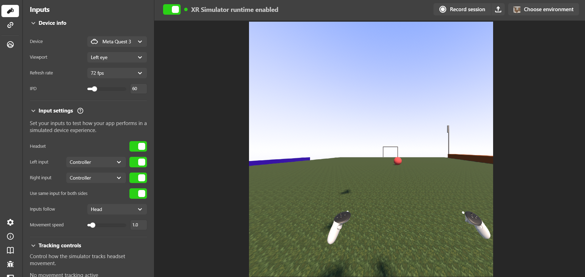

# Arena de Treinamento Esportivo e Análise de Física em Realidade Virtual

## 👤 Autor
* **Nome Completo:** Matheus Guilherme Madureira

---

## ⚽ Apresentando o Seu Projeto
Este projeto consiste num ecossistema de **Realidade Virtual (VR)** interativo e imersivo focado em simulação esportiva. A aplicação disponibiliza uma infraestrutura tridimensional de uma arena de futebol digital, composta por elementos posicionados de forma coerente (gramado texturizado, traves, arquibancadas, postes de iluminação e placas publicitárias). 

O projeto rompe com a passividade de cenários virtuais estáticos ao introduzir engenharia de software via C#. Ao interagir com a bola através dos controladores de VR, o sistema processa o comando em tempo real, gerando um impulso físico vetorizado realista e alterando dinamicamente a propriedade visual do material para a cor **Vermelha**, provendo um ciclo completo de feedback (*input-output*).

<p align="center">
    
</p>

---

## 🎯 Contexto e Objetivos
A criação desta arena tem como finalidade solucionar problemas práticos de engajamento, acessibilidade e validação científica no Metaverso, dividindo-se em dois pilares fundamentais:

* **Entretenimento e Gamificação:** O ambiente fornece um espaço de simulação intuitivo e imersivo, permitindo a usuários finais vivenciarem a mecânica de esportes tradicionais de forma virtual com alta fidelidade de interação, abrindo precedentes para ecossistemas globais de e-sports em ambientes XR.

---

## 🛠️ Configuração Técnica e Compatibilidade Meta XR
O projeto foi desenvolvido sob rigorosos padrões de engenharia XR, garantindo compatibilidade nativa com a plataforma **Meta Quest (Android)**.

### Indicadores de Compatibilidade no Repositório:
* **`ProjectSettings/`:** Configurado para a plataforma de Build **Android**, com suporte a **OpenXR** e o loader do **Oculus XR Plugin** ativado.
* **`Packages/`:** Manifesto interno estruturado com as dependências do **Meta XR Core SDK** e do **Meta XR Interaction SDK**, garantindo que o motor descarregue os pacotes corretos na compilação.
* **Meta XR Simulator:** Configuração validada via runtime do simulador, permitindo testes completos e mapeamento de inputs diretamente no Editor (PC) com mãos virtuais.

---

## 📁 Estrutura de Arquivos e Organização do Projeto

Para cumprir as boas práticas de desenvolvimento na Unity e manter o repositório limpo, a hierarquia de pastas foi organizada da seguinte forma:

```text
📦 Raiz do Repositório
 ┣ 📁 Assets
 ┃ ┣ 📁 Materials          # Materiais da cena (Gramado_Pro, MeuCeu, Material_Bola)
 ┃ ┣ 📁 Scenes             # Arquivo da cena principal (.unity)
 ┃ ┣ 📁 Scripts            # Lógica programada em C#
 ┃ ┃ ┗ 📜 ChuteBola.cs     # Script de física e controle de inputs interativos
 ┃ ┗ 📜 README.md          # Documentação técnica do projeto
 ┣ 📁 Packages             # Manifesto de dependências do Meta XR SDK
 ┗ 📁 ProjectSettings      # Configurações de input, física e build para Android
```

## 🧠  Resolução de Desafios
1. Transição de Modelo de Inputs (Unity Input System)
    - Desafio: A Unity bloqueava a execução de chamadas clássicas como Input.mousePosition com erros de InvalidOperationException devido à ativação do novo ecossistema do Unity Input System exigido pelo SDK da Meta.

    - Solução: O script foi estruturado utilizando a API moderna UnityEngine.InputSystem, consumindo dados do Mouse.current e convertendo as coordenadas de ecrã para raios matemáticos no espaço 3D (ScreenPointToRay).

2. Sobreposição de Colisores Fantasmas do SDK
    - Desafio: Durante a calibração das ferramentas visuais do Building Blocks, blocos redundantes de teste ([BuildingBlock] Cube) foram gerados de forma invisível sobre o centro do mapa, criando uma barreira que interceptava os raios interativos da Meta e impedia o sinal de chegar à bola.

    - Solução: Realizou-se uma auditoria na árvore de hierarquia (Hierarchy Window) para expurgar objetos órfãos. O código C# foi blindado com o método OnTriggerEnter, mapeando especificamente substrings do laser interativo da Meta (Ray, Interactor, Controller), garantindo resiliência nos testes.

3. Ciclo de Vida da Física Dinâmica (Trigger vs Solid)
    - Desafio: Para que o ponteiro laser de VR detetasse a bola sem empurrá-la de forma errática antes do comando, o colisor precisava de atuar como um sensor (isTrigger = true). Contudo, isto anulava a colisão sólida e a força da gravidade fazia a bola atravessar o chão.

    - Solução: Desenvolveu-se um comportamento assíncrono por estado: a bola inicia estática no solo com a gravidade desativada (useGravity = false). No exato frame em que o colisor do laser interage com a bola, o script altera dinamicamente a propriedade para sólido (isTrigger = false), ativa a gravidade física no Rigidbody e injeta a força instantânea via ForceMode.Impulse.